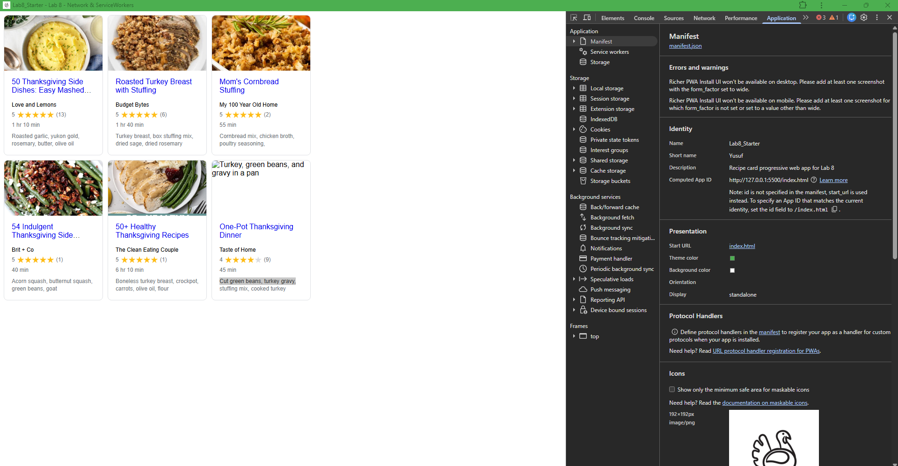

# Lab8-Starter

## Partner(s)
Yusuf Damda (Worked alone)

## GitHub Pages URL
https://yusufdamda-ucsd.github.io/Lab8_Starter/

## Graceful Degradation and Service Workers
Graceful degradation and service workers are connected because they both help make a website more reliable when things do not go perfectly. Graceful degradation is the idea that a website should still be usable even if certain features fail, like having a weak or no internet connection. Service workers help with this by caching website files and network requests so users can still load and use parts of the site without depending completely on the internet. This makes the overall experience smoother and keeps the website functional under different conditions.

## PWA Screenshot
